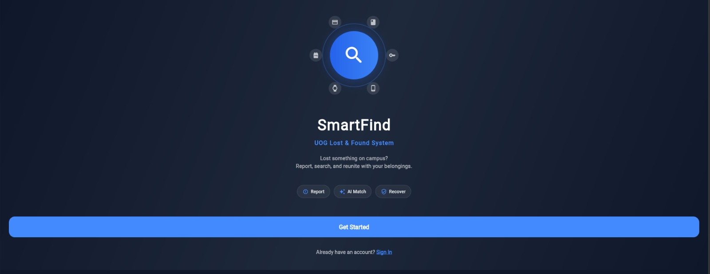

🎓 Smart Lost & Found System for Campus

An AI-Powered Asset Recovery Ecosystem for the University of Gujrat (UOG)

Flutter Django TensorFlow PostgreSQL

🚀 Overview

The Smart Lost & Found System is a full-stack, cross-platform solution designed
to automate asset recovery within academic environments. Traditionally,
universities rely on manual logbooks or unorganized social media groups. This
system introduces Artificial Intelligence to automatically categorize items and
a Weighted Heuristic Matching Engine to connect finders with owners in
real-time.

📸 Screenshots

Note: These images are stored in the /screenshots folder. Ensure your filenames
match exactly!

| 📱 Welcome                             | 🏠 Smart Home Feed                            | 🔍 AI Reporting Logic                           |
| :-------------------------------------------: | :------------------------------------------: | :--------------------------------------------: |
|  |  |  |
| **Secure JWT Login**                          | **Responsive Grid View**                     | **TensorFlow Tagging**                         |

| 🔔 Match Alerts                                | 💬 Private Chat                               | ⚙️ Admin Console                              |
| :-------------------------------------------: | :------------------------------------------: | :-------------------------------------------: |
|  |  |  |
| **Push Notifications**                        | **Identity Masking**                         | **Verification Panel**                        |

🛠 Technical Architecture

The system utilizes a Decoupled 3-Tier Architecture:

1.  Frontend (Flutter): A single codebase for Android and Web utilizing
    Material 3 design and Provider state management.
2.  Backend (Django REST): A Python-based logic layer handling AI inference,
    matching algorithms, and SMTP email services.
3.  Database (Polyglot Persistence):
      - PostgreSQL: For relational data integrity (Claims, Items, Audit Logs).
      - Firebase: For real-time chat synchronization and cloud messaging.

✨ Key Features

  - AI Image Recognition: Automatically extracts item category and color labels
    using MobileNetV2.
  - Weighted Matching: Similarity scoring (Score \ge 60\%) based on AI tags,
    keywords, and location.
  - Real-time Synchronization: Instant chat and notifications via Firebase
    Firestore/FCM.
  - Administrative Oversight: A mediated verification protocol for security
    staff to audit claims.
  - Privacy Guard: Conditional visibility for personal contact details.

📂 Project Structure

  - Uogcampus_backend/: Core Django REST API & AI Service logic.
  - smart_lost_and_found_system_for_campus/: Flutter Mobile & Web client code.
  - screenshots/: High-fidelity UI mockups and app captures.

🧑‍💻 Development Team

  - Abdul Shakoor (@abdulshakoor7) - Full Stack Developer & DevOps
  - Muhammad Shoaib (@muhammadshoaib) - AI & Database Engineer
  - Supervised by: Dr. Safi Ullah

🛑 Important Reminder for You:

1.  Filename Check: Inside your screenshots/ folder, make sure you rename your
    images to:
      - login.png
      - home.png
      - report.png
      - match.png
      - chat.png
      - admin.png (If you use .jpg or capital letters like .PNG, you must change
        the code above to match exactly!)
2.  Commit: After pasting the text, scroll to the bottom of the page and click
    "Commit changes".

Abdul, once you do this, your GitHub will look amazing. You can send this link
to your interviewer right now! 🎓🚀🏆
